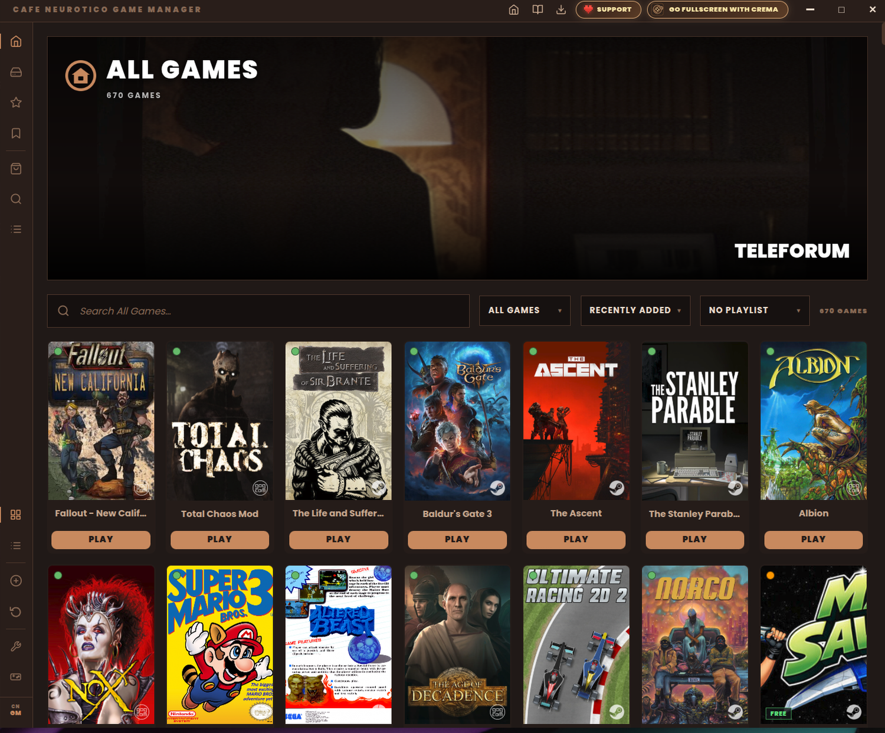
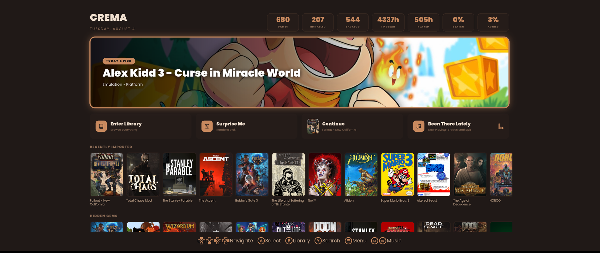

<div align="center">

# Cafe Neurotico

### *your Linux game library, brewed into one app*


-e58a70?style=flat-square)


**[Download the AppImage](https://github.com/shampoo-is-a-lie/CafeNeurotico/releases/latest)** ·
[macOS build (Experimental)](docs/macos-guide.md) ·
[Website](https://shampoo-is-a-lie.github.io/CafeNeuroticoWebSite/) ·
[Support](https://shampoo-is-a-lie.github.io/CafeNeuroticoWebSite/support.html)

</div>

---

```console
cafeneurotico@linux:~$ ./brew
[ ok ] mounting library................ Manager
[ ok ] roasting GOG/Epic engine........ GRINDER
[ ok ] pouring fullscreen interface.... CREMA
[ ok ] blending into one shot.......... done

▓▓ CAFE NEUROTICO 1.3 ▓▓
> three faces, one binary. served.
```

---

<div align="center">

### The Manager — your library on the desktop



### CREMA — the same library, on the TV



</div>

---

## Today's brew — one shot, three notes

| | | |
|---|---|---|
| **The Manager** | your whole Linux game library, one shelf | *(formerly CNGM)* |
| **GRINDER** | roasts & installs your GOG / Epic games | *the robot barista* |
| **CREMA** | the fullscreen, gamepad-first crema on top | *the bon vivant* |

Three apps that used to ship separately are now **one Electron binary with three faces**, dispatched by argv — one runtime, one `better-sqlite3`, one copy of the helper binaries. It replaces the now-archived
[CafeNeuroticoGameManager](https://github.com/shampoo-is-a-lie/CafeNeuroticoGameManager) ·
[GRINDER](https://github.com/shampoo-is-a-lie/GRINDER) ·
[CREMA](https://github.com/shampoo-is-a-lie/CREMA).

## The three faces

| Pour it like this | …and you get |
|-------------------|--------------|
| `cafeneurotico` | **The Manager** — windowed library hub |
| `cafeneurotico grinder <cmd>` | **GRINDER** — GOG/Epic install/launch engine (+ GUI) |
| `cafeneurotico --crema` | **CREMA** — fullscreen, gamepad interface |

All three read and write the **same database**. Favourite a game on the couch, it's favourited on the desktop.

## What's in the cup

**One library, every store.** Steam (API + a local scan that catches the free games and demos Steam's API hides), GOG and Epic (signed in from inside the app — no browser dance, no external launcher), Flatpak, itch.io, PICO-8, emulators, and anything else you can start from a command line. Refresh adds new purchases *and* removes what you refunded.

**Install and launch, in-process.** GOG and Epic games download through the built-in GRINDER engine with live progress, a queue, disk-space checks, and a Linux-or-Windows build choice for the games that ship both. One install folder for everything, changeable in one place, overridable per game. Per-game Proton version, prefix, winetricks and env vars when you want them; a verbose **Play with Log** window when you want the raw output.

**Proton, found for you — and failures you can see.** Windows games need Proton, so the suite locates it on your machine whatever the folder is called (Steam's builds, GE-Proton, whatever ProtonUp-Qt installed) and hands it over explicitly instead of hoping the launcher guesses right. If you have none, it offers to install GE-Proton in one click. A game that dies on startup says so, with the details a click away — no more pressing Play and watching nothing happen. The slow first launch of a Windows game shows real progress while the runtime downloads and its Windows environment is built.

**Artwork that stays put.** Covers, hero art, logos, screenshots, descriptions, HowLongToBeat, Metacritic and ProtonDB tiers, scraped from Steam, SteamGridDB and IGDB and stored **locally**. No link rot when a storefront changes its API. Trailers download as real MP4 files.

**Save games, handled honestly.** Locate → zip → restore, for installed GOG and Epic games. Backups are portable ZIPs with a manifest, so one made on your desktop restores correctly on your laptop. A snapshot is taken before every restore. Nothing is uploaded anywhere.

**A living-room mode that isn't an afterthought.** CREMA is fullscreen, gamepad-first, TV-typography: carousel or grid start screen, immersive or classic gamepages, achievements, a jukebox for your own music, an on-screen keyboard, and a screensaver built from your own screenshots.

**93 themes across 10 families** — Catppuccin, Gruvbox, Nord, Dracula, Game Boy, Pip-Boy, BrewBalance, and twenty faithful retro-OS palettes (MS-DOS, Commodore 64, Amiga Workbench, BeOS, NeXTSTEP, Windows 3.1/95/XP, ZX Spectrum, Teletext…) each with its own era typeface. Plus six bundled interface fonts. Shared by all three faces.

**Genres that mean something.** Stores tell you where a game came from; the suite tells you what it *is*. One scan sorts your library into ARPG, CRPG, FPS, Metroidvania, Soulslike, Shmup, Survival Horror, Point & Click and forty more — read from the tags players actually voted on, which is the only source that can tell a Diablo-like from a Baldur's Gate-like, with IGDB covering what the stores never listed. Filter by genre next to the search box on the desktop or from the menu on the TV, combine it with anything else (*GOG + CRPG + Installed*), and disagree with any of it: a genre you set by hand is pinned and no future scan will touch it.

**Playlists that fill themselves.** Give a new playlist a genre instead of a list of games and it maintains its own membership forever — it tells you how many it collects before you commit, and every game you buy that fits simply turns up in it.

**The manual, where the game keeps it.** Plenty of games — RPGs above all — still expect you to read something, and the file is usually already on your disk without anyone telling you. A book button on the gamepage finds it: GOG names its own documents, so Realms of Arkania offers you *Manual*, *Cluebook* and *Password reference card* rather than three filenames. For GOG games it can also fetch the scanned originals from the store. A game can hold as many as it needs, read in a window you can drag to a second monitor and keep open while you play.

**DOS games that actually start.** GOG's DOS titles ship a Windows DOSBox and a config that only works from the right folder — get either wrong and the window opens and closes. Both are handled, including the configs GOG's installer copies and `gogdl` never did. Optionally hand the job to a native DOSBox instead: it reads the very same GOG config, so every tweak made for that game survives and only the emulator changes.

**Fan games, source ports and mods — installed properly.** A catalogue of things the suite knows how to set up from a file you already downloaded: Ironwail, vkQuake, GZDoom, ECWolf, Raze, BuildGDX, CannonBall, OpenBOR titles, Mini Doom, SWOS 2020, Brutal Doom. Each entry says exactly where to get the download and what the file is called — that being the step that actually stops people. **You bring the port; the suite finds the game data.** A source port without its data is not a game, and you very likely already own the data in the library the suite is already managing: install Ironwail and Quake's paks are linked out of your GOG copy, install GZDoom and every Doom IWAD you own turns up beside it. Own it but not installed? It says so by name. Never sold in a form a library can hold — arcade ROMs, files off an old disc — and it asks you to point at them.

**Games, not engines.** Nobody sets out to install GZDoom; they set out to play Brutal Doom. So mods and Build games are entries in their own right — Blood, Duke Nukem 3D, Shadow Warrior, PowerSlave, Redneck Rampage, both Witchavens — each installing its engine if needed and appearing under its own name. The choices that vary by mood happen when you press Play: *which Doom* a mod runs on, and *which engine* runs a game two of them support. Anything not in the catalogue is still one click: point at a folder and it joins your library where it sits, or hand *Any Quake mod* / *Any Doom mod* an archive and pick what loads. **OpenBOR has a category of its own** — one engine, one rigid layout, its own way of packaging a game — so its titles sit beside Steam and GOG in the filter row rather than under Others.

**Old Windows games that ship their own fix.** Plenty of nineties titles come with a community patch in a file like `ddraw.dll`, `opengl32.dll` or `dinput8.dll` — a translation, a renderer, a timing fix, a mod loader. On Windows the game's own copy wins; Wine normally overrides it, so the patch never runs and the game either dies on startup or comes up in the wrong language. The suite hands the game its own, with Wine's behind it as a fallback. Nothing to configure, and it applies to every game that does this.

**Games that have been fixed individually.** The rule above is general, and most compatibility problems are. What is left over is the awkward remainder: a fault belonging to one specific game and to nothing else. Those are written down as fixes in their own right and applied when the game starts — *OutRun 2006*, which opens to a white screen and looks hung on the SEGA logo when it is really just grinding through a minute of intro videos; *Resident Evil 2* with Classic REbirth; GOG's Windows builds of *Quake*; *Fallout: New California*; *Realms of Arkania*; *Albion*; *Colony Ship*. Each one cost an evening to work out, which is exactly why it is worth writing down. [**The whole list, with what was wrong in each case →**](https://shampoo-is-a-lie.github.io/CafeNeuroticoWebSite/fixes.html)

**Pick which version starts.** A GOG release often ships several ways to launch and the store never shows you: Quake: The Offering has seven, and only one of them plays the CD soundtrack. The gamepage lets you choose, and remembers.

**Can't decide?** *Pick a Random Game* draws from whatever the gallery is currently showing — so set the filters to GOG, strategy, not-installed and it becomes "pick me something off the pile I keep meaning to start". It avoids repeating its last ten picks.

**A dashboard if you want one.** An optional drag-and-drop widget board: roulette, backlog weight, throwback, achievement completion, disk footprint, and strictly opt-in online widgets (deals, Epic freebies, RSS gaming news, Steam patch notes) that make **zero network calls until you enable them**.

**Updates you asked for.** *Scan for Updates* checks your installed GOG and Epic games against the store — real version numbers, updated in-app with one press — and flags Steam games with a pending download so Steam can handle its own. The app itself never phones home: the Control Panel shows the version you're running with a **Check for Updates** button that simply opens the releases page, and you decide whether to download it.

**Which screen games open on.** On a multi-monitor machine games land on whichever screen the desktop calls primary, and most of them offer no way to change it. Pick the monitor by name and size — a connector called DP-4 tells nobody anything — and every game opens there. KDE only, and the setting is hidden entirely elsewhere and on single-monitor machines rather than offered where it cannot work; nothing is written into your KDE configuration.

**A shortcut for the one game you always play.** *Add to Desktop* writes a proper `.desktop` launcher — the game's own art as the icon — that opens straight into it through the suite, in your app menu, on your desktop, or both.

**Local-only, portable, backupable.** Everything lives in a `GameManagerConfig` folder next to the AppImage. Put it on a thumb drive, take your library to another machine. No account, no telemetry, no cloud.

## macOS — Experimental

Cafe Neurotico also runs on Apple Silicon Macs, built from the exact same codebase behind a host
boundary rather than a fork. **Linux stays primary** — it's what ships fastest and gets tested
first — but the Mac build is real: Steam/GOG/Epic sign-in, the full library, and installing and
launching Mac-native GOG/Epic games all work today, including a filter and cover badge for which
of your owned games actually have a native macOS build. Windows games need a compatibility layer
that isn't wired in yet, so that's the one major gap. **[Full install instructions, what works,
and what doesn't →](docs/macos-guide.md)**

## The rest of the ecosystem

**[EmuLatte](https://github.com/shampoo-is-a-lie/EmuLatte)** — *"I use RetroArch BTW"* — is the emulation pillar, and it is **entirely optional**. It's a separate AppImage that manages ROMs, emulators and RetroAchievements with its own scraping sources. Cafe Neurotico works perfectly without it; drop `EmuLatte.AppImage` next to it and the suite picks it up and adds it to the app menu and the icon rail.

Your ROM library stays in EmuLatte — Cafe Neurotico doesn't absorb it. You choose which games cross over by **exporting them to Cafe Neurotico from inside EmuLatte**, and only those arrive, as ordinary library entries filed under **Emulation** that play and scrape like anything else. Curate the collection in EmuLatte; promote the handful you actually want on the shelf.

**[CafeNeuroticoClock](https://github.com/shampoo-is-a-lie/CafeNeuroticoClock)** — a desk clock that runs a slideshow of your library's art.

## Grind your own

```sh
git clone https://github.com/shampoo-is-a-lie/CafeNeurotico.git
cd CafeNeurotico
npm install          # deps + rebuilds better-sqlite3; pulls the helper binaries (GitHub Release)
npm start            # run the Manager face
npm run start:crema  # run the CREMA face
npm run dist         # build CafeNeurotico.AppImage
```

```
cafeneurotico/
├── main.js          # single Electron entry — argv dispatch + window factory
├── packages/core/   # shared engine + IPC (db, metadata, grinder, trailers, settings)
└── apps/
    ├── manager/     # The Manager face
    ├── grinder/     # GRINDER engine + GUI
    └── crema/       # CREMA fullscreen face
```

> Helper binaries (ffmpeg / yt-dlp / gogdl / legendary / comet) are fetched from this repo's
> GitHub Releases — keeping the repo and the AppImage lean.

**Requirements:** a 64-bit Linux desktop, and FUSE for the AppImage — or an Apple Silicon Mac for the [Experimental macOS build](docs/macos-guide.md). The Steam import needs a free Steam API key; SteamGridDB and IGDB scraping need their own free keys. Everything else works out of the box.

## Documentation

The full manual ships **inside the app** — 22 searchable sections under Menu → Manual, covering every face, the complete CREMA control reference, save backups and troubleshooting.

## Tip the barista

If Cafe Neurotico organized your gaming life, consider buying me a coffee — it keeps the pot warm.
**"more caffeine is `more good`."**

- **Ko-fi (Intl):** <https://ko-fi.com/cafeneurotico>
- **PIX (Brazil):** `b734a9e2-e479-42f9-abd6-c88d1b8b880e`

If you do, [let me know](mailto:shampooisalie@gmail.com) so I can thank you personally! :)

---

<div align="center">

**▸ one library · three faces · zero cloud**

Built by J.R.A. · `shampooisalie@gmail.com` · GPL-3.0-or-later

</div>
